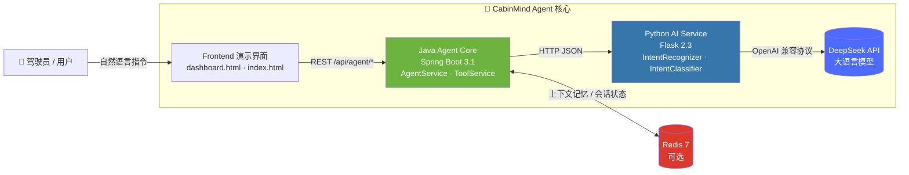

<div align="center">

# 🚗 CabinMind

### Intelligent Cockpit AI Agent · 智能座舱 AI Agent

让座舱真正"听懂"人话 —— 一个面向智能座舱场景的 AI Agent 原型，集**意图识别 · 工具调用 · 上下文记忆**于一身，Java + Python 混合架构，开箱即用。

> **EN** · CabinMind is an AI agent prototype for smart cockpit scenarios, built on a Java (Spring Boot) + Python (Flask) hybrid architecture powered by DeepSeek LLM — custom intent-classification algorithms, extensible tool calling, Redis-backed context memory, and a mock mode for key-free development. Fully containerized with Docker.

[](https://spring.io/projects/spring-boot)
[](https://flask.palletsprojects.com/)
[](https://www.deepseek.com/)
[](https://redis.io/)
[](https://www.docker.com/)
[](https://www.oracle.com/java/)
[](https://www.python.org/)
[](LICENSE)

[快速开始](#快速开始) · [API 示例](#api-示例) · [环境变量](#环境变量说明) · [项目结构](#项目结构)

</div>

---

## ✨ 项目简介

**CabinMind** 是一个面向智能座舱（Smart Cockpit）场景的 **AI Agent** 原型项目。驾驶员通过自然语言下达指令，CabinMind 完成从"听懂"到"执行"的完整闭环：

- 🧠 **意图识别** —— 基于自定义算法的自然语言意图分类，理解"把空调温度调到 22 度"背后的真实意图；
- 🛠️ **工具调用** —— 编排空调、媒体、导航、车窗等座舱工具，将意图转化为可执行的动作；
- 💬 **上下文记忆** —— 基于 Redis 的会话记忆，让 Agent 在多轮对话中保持连贯的"车感"。

项目采用 **Java + Python 混合架构**：Spring Boot 3.1 负责业务编排与工具调用，Flask 2.3 承载 AI 服务与自定义算法，通过 DeepSeek API 提供大模型能力。提供 Docker 一键部署与 **MOCK 模式**（免 API Key 即可本地调试），上手成本极低。

---

## ✅ 核心特性

- ✅ **自然语言意图识别** —— 自研混合意图分类算法（关键词 + 规则 + 大模型兜底），座舱场景专属意图体系
- ✅ **多工具调用** —— `ToolService` 统一管理空调 / 媒体 / 导航 / 车窗等工具，支持参数提取与执行超时控制
- ✅ **上下文记忆** —— Redis 7 可选支持，多轮对话上下文 + 会话超时管理（无需 Redis 也能运行）
- ✅ **Java + Python 混合架构** —— Spring Boot 3.1 业务编排 × Flask 2.3 AI 能力，各司其职
- ✅ **Docker 一键部署** —— `docker-compose up` 拉起 Redis + Python + Java + Nginx 全栈
- ✅ **MOCK 模式** —— `MOCK_MODE=true` 无需 API Key 即可完整体验意图识别与工具调用流程
- ✅ **内置演示与文档** —— 可视化座舱 Dashboard、端到端测试脚本、Swagger 在线 API 文档

---

## 🏗️ 架构设计



**处理链路**：用户指令 → Java Agent Core 编排 → Python AI Service 意图识别（自定义算法 + DeepSeek 兜底）→ 返回结构化意图 → Java `ToolService` 执行对应座舱工具 → 结合 Redis 上下文生成最终响应。

---

## 🚀 快速开始

### 前置要求

| 依赖 | 版本 | 说明 |
| --- | --- | --- |
| JDK | 17+ | Java 后端运行环境 |
| Python | 3.9+ | Python AI 服务运行环境 |
| Maven | 3.6+ | Java 项目构建 |
| Redis | 7.x（可选） | 上下文记忆，不装也能跑 |
| Docker | 20.10+（可选） | 容器化一键部署 |

### 1️⃣ 配置环境变量

```bash
# 复制环境变量模板（Windows: copy shared\.env.example .env）
cp shared/.env.example .env
```

然后编辑 `.env`：

```bash
# ⚠️ 必填：替换为你的 DeepSeek API Key（https://platform.deepseek.com）
DEEPSEEK_API_KEY=sk-your-key-here

# 💡 免 Key 调试：设为 true 后走内置模拟数据，无需 API Key
MOCK_MODE=false
```

### 2️⃣ 一键启动（推荐）

**Linux / macOS：**

```bash
chmod +x start.sh
./start.sh
```

**Windows：**

```bat
start.bat
```

### 3️⃣ 手动启动（分开调试）

```bash
# 终端 A —— 启动 Python AI 服务（端口 5000）
cd python-ai-service
pip install -r requirements.txt
python app.py

# 终端 B —— 启动 Java 后端（端口 8080）
cd java-backend
mvn spring-boot:run
```

### 4️⃣ Docker 部署

```bash
cd shared
# 如使用真实 API，取消 docker-compose.yml 中 DEEPSEEK_API_KEY 一行的注释
docker-compose up -d
```

启动完成后：

- 🖥️ 演示界面：`frontend/dashboard.html`（或经 Nginx `http://localhost`）
- 📄 Swagger 文档：`http://localhost:8080/swagger-ui.html`
- 🌡️ 健康检查：`http://localhost:8080/api/agent/health/simple`

### 5️⃣ 端到端演示

```bash
python test_demo.py
```

---

## 🧪 API 示例

```bash
# 完整 Agent 处理（Java 8080）
curl -X POST http://localhost:8080/api/agent/process \
  -H "Content-Type: application/json" \
  -d '{"message": "播放周杰伦的音乐，音量调到80", "sessionId": "test-session", "verbose": true}'

# 意图识别（Python 5000）
curl -X POST http://localhost:5000/api/intent/recognize \
  -H "Content-Type: application/json" \
  -d '{"message": "把空调温度调到22度", "sessionId": "test-session"}'
```

---

## ⚙️ 环境变量说明

> 完整模板见 [`shared/.env.example`](shared/.env.example)

| 变量 | 说明 | 默认值 | 必填 |
| --- | --- | --- | --- |
| `DEEPSEEK_API_KEY` | DeepSeek API 密钥（`MOCK_MODE=true` 时可不填） | 无 | ✅ |
| `DEEPSEEK_API_URL` | DeepSeek API 地址 | `https://api.deepseek.com` | ❌ |
| `DEEPSEEK_MODEL` | 使用的模型名称 | `deepseek-chat` | ❌ |
| `REDIS_HOST` | Redis 主机地址 | `localhost` | ❌ |
| `REDIS_PORT` | Redis 端口 | `6379` | ❌ |
| `REDIS_PASSWORD` | Redis 密码（无则留空） | 空 | ❌ |
| `REDIS_DB` | Redis 数据库索引 | `0` | ❌ |
| `JAVA_SERVER_PORT` | Java 后端服务端口 | `8080` | ❌ |
| `PYTHON_SERVER_PORT` | Python AI 服务端口 | `5000` | ❌ |
| `APP_NAME` | 应用名称 | `smart-cabin-agent` | ❌ |
| `APP_VERSION` | 应用版本 | `1.0.0` | ❌ |
| `APP_ENVIRONMENT` | 运行环境（development / production） | `development` | ❌ |
| `LOG_LEVEL` | 日志级别 | `INFO` | ❌ |
| `LOG_FILE_PATH` | 日志文件路径 | `./logs/app.log` | ❌ |
| `MAX_CONTEXT_LENGTH` | 上下文记忆最大条数 | `10` | ❌ |
| `SESSION_TIMEOUT_MINUTES` | 会话超时时间（分钟） | `30` | ❌ |
| `TOOL_EXECUTION_TIMEOUT_MS` | 工具执行超时（毫秒） | `5000` | ❌ |
| `MAX_TOOL_RETRIES` | 工具调用最大重试次数 | `3` | ❌ |
| `MOCK_MODE` | 模拟模式（`true` 免 Key 调试，`false` 使用真实 API） | `false` | ❌ |

---

## 📁 项目结构

```
smart-cabin-agent/
├── java-backend/                    # 🍃 Spring Boot 3.1 主服务（业务编排 + 工具调用）
│   ├── src/main/java/com/smartcabin/
│   │   ├── controller/              #   REST 控制器（AgentController）
│   │   ├── service/                 #   业务层（AgentService / ToolService / PythonBridgeService）
│   │   ├── model/                   #   数据模型（AgentRequest / AgentResponse）
│   │   └── config/                  #   配置（SwaggerConfig 等）
│   ├── src/main/resources/          #   application.yml
│   ├── Dockerfile
│   └── pom.xml
├── python-ai-service/               # 🐍 Flask 2.3 AI 服务（意图识别 + 大模型）
│   ├── app.py                       #   Flask 入口（/api/intent/recognize 等）
│   ├── services/                    #   DeepSeekService · IntentRecognizer
│   ├── algorithms/                  #   自定义意图分类算法 IntentClassifier
│   ├── requirements.txt
│   └── Dockerfile
├── frontend/                        # 🎨 前端演示界面
│   ├── dashboard.html               #   座舱控制台演示
│   └── index.html                   #   入口页
├── shared/                          # 📦 共享配置
│   ├── .env.example                 #   环境变量模板
│   └── docker-compose.yml           #   Docker Compose 编排
├── start.sh                         # 🚀 一键启动脚本（Linux / macOS）
├── start.bat                        # 🚀 一键启动脚本（Windows）
├── test_demo.py                     # 🧪 端到端演示脚本
└── README.md
```

---

## 🛣️ Roadmap

- [ ] 接入更多座舱工具（座椅、氛围灯、语音播报）
- [ ] 基于向量数据库的长期记忆
- [ ] 多模态输入支持（手势 / 视线）
- [ ] WebSocket 实时流式响应

---

## 🤝 贡献指南

欢迎提交 Issue 与 Pull Request：

1. Fork 本仓库并创建功能分支
2. 提交你的改动（遵循 Conventional Commits 规范）
3. 发起 Pull Request 并描述改动内容

---

## 📄 License

本项目基于 [MIT License](LICENSE) 开源，欢迎自由使用与二次开发。

---

<div align="center">

**© 2026**

</div>
